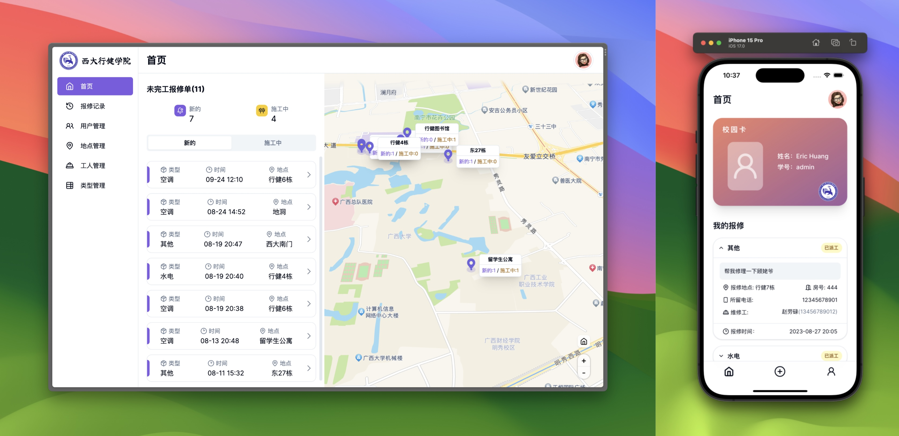

# 👷🏻 后勤报修管理系统

## 📝 简介

本项目是一个基于`TypeScript + Next.js 14 (App Router)` 开发的后勤报修管理系统，由管理员端（Web端）和用户端（以PWA形式的移动设备）组成，管理员端可对用户、维修单、维修工人进行管理，用户端可进行报修单的提交、查看等功能；通过Web Worker技术，实现了两端只要开启通知权限，都可以接收到维修单状态的最新动态推送通知。



## 🚀 技术栈

- `Next.js 14 (App Router)`
- `Tailwindcss`
- `shadcn/ui`
- `高德地图SDK`
- `PWA + Web Worker`
- `useSWR`
- `Next-Auth`
- `Prisma ORM`
- `PostgreSQL`

## 🛠️ 功能

### 👨🏻‍💼 管理员端

- 登录/登出
- 数据面板
- 用户管理
- 维修单管理
- 报修工人管理
- 报修类型管理
- 报修位置管理（通过高德地图进行可视化操作）

## 📱 用户端

- 登录/登出
- 查看历史维修单列表
- 创建报修单
- 可安装（PWA），并接收到维修单状态的最新动态推送通知

## 🛠️ 本地开发

1. 首先 `git clone` 本仓库，然后进入项目目录，执行以下命令：

   ```bash
   pnpm install
   pnpm dev
   ```

2. 将项目根目录下的`.env.`和`.env.development`中的环境变量配置好，尤其是`.env.development`中的`DATABASE_URL`(即你的数据库url)，并启动好数据库。

3. 初始化并seeding数据库(将一些模拟数据和管理员账号写进数据库)：

   ```bash
   pnpm add -g dotenv-cli
   pnpm run resetDB:dev
   ```

4. 之后在浏览器打开 [http://localhost:3000](http://localhost:3000) 即可。

## 📦 部署

### Vercel部署

只需要将本仓库fork到自己的GitHub Repo下，再将项目对应的`.env`文件配置好然后在Vercel中导入即可。

### Docker部署

首先将本仓库clone到本地，然后进入项目目录，配置好`.env`与`docker-compose.yml`对应的环境变量之后后执行以下命令即可完成部署：

```bash
docker-compose up -d
```

之后在浏览器打开 [http://localhost](http://localhost) 即可（已由nginx进行反向代理到80端口）。
